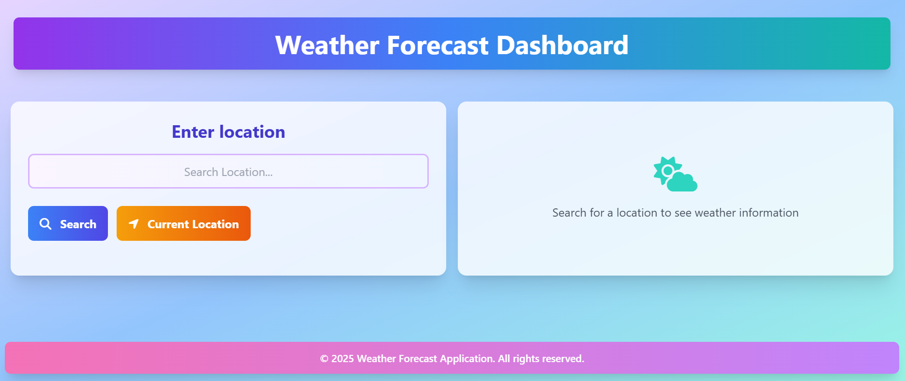

# Weather Forecast Application

A responsive weather dashboard that displays current weather conditions and 6-day forecasts for any location worldwide, with geolocation support.

## Features

- 🌦️ Current weather conditions (temperature, humidity, wind speed, etc.)
- 📅 6-day weather forecast
- 🔍 Search by city name
- 📍 Get weather for current location
- ⏱️ Recent searches dropdown
- 📱 Fully responsive design (iPhone SE, iPad, Desktop)
- 🎨 Beautiful UI with weather-appropriate icons
- ⚡ Real-time data from OpenWeatherMap API

## Technologies Used

- HTML5
- CSS3 (with Tailwind CSS via CDN)
- JavaScript (ES6)
- OpenWeatherMap API

## Setup Instructions

Since I'm using CDN links and running locally, setup is simple:

1. **Clone the repository**:
   git clone https://github.com/Ushnika09/Weather_App.git
   

2. **Navigate to project directory**:

   cd weather-forecast-app
    

3. **Open the application**:
   - Simply open `index.html` in your preferred browser
     Then visit `http://localhost:8000`

## API Key Configuration

The app currently uses a hardcoded OpenWeatherMap API key. For production use:

1. Get your own free API key from [OpenWeatherMap](https://openweathermap.org/api)
2. Replace in `script.js`:
  
   const apiKey = "6355bd5aa05ce5fe54fc409f52012414"; // Replace with your key

## Browser Support

The application works on all modern browsers including:
- Chrome (latest)

## Project Structure

weather-forecast-app/
├── index.html          # Main application HTML
├── script.js           # All JavaScript functionality
└── README.md           # This documentation file

## Known Limitations

- Requires internet connection to fetch weather data
- Geolocation requires user permission
- Limited to 5 recent searches due to session storage
- API key is visible in client-side code

## Future Improvements

- Adding temperature unit toggle (°C/°F)
- Implement local storage fallback
- Add weather maps or radar
- Include air quality data
- Implement PWA features for offline use
